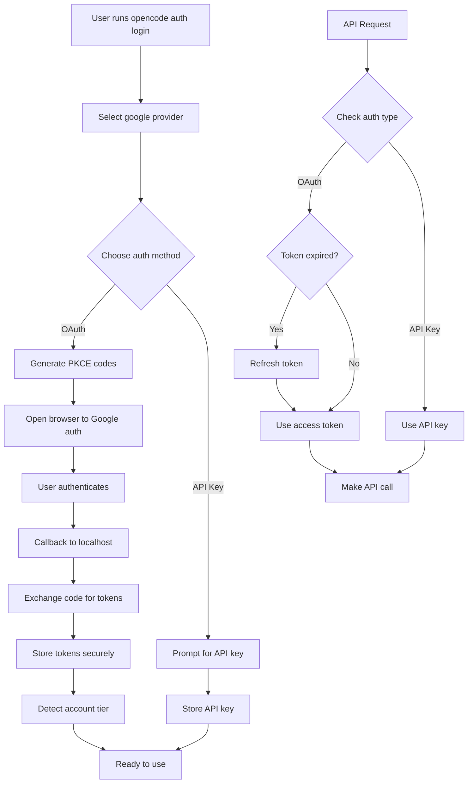

# Google AI Pro/Ultra OAuth Implementation Plan

## Overview

This document outlines the implementation plan for adding OAuth authentication support for Google AI Pro/Ultra plan accounts as an additional login option alongside the existing API key-based authentication.

## Architecture

### 1. New Plugin: `packages/opencode/src/plugin/google.ts`

Following the pattern established by [`codex.ts`](packages/opencode/src/plugin/codex.ts:1) and [`copilot.ts`](packages/opencode/src/plugin/copilot.ts:1), we will create a new internal plugin for Google OAuth authentication.

```typescript
// packages/opencode/src/plugin/google.ts
export async function GoogleAuthPlugin(input: PluginInput): Promise<Hooks> {
  return {
    auth: {
      provider: "google",
      async loader(getAuth, provider) {
        /* ... */
      },
      methods: [
        {
          type: "oauth",
          label: "Google AI Pro/Ultra (OAuth)",
          authorize: async () => {
            /* PKCE flow */
          },
        },
        {
          type: "api",
          label: "API Key",
        },
      ],
    },
  }
}
```

### 2. OAuth Flow Design

Based on Google's OAuth 2.0 for Desktop Apps documentation and the existing Codex implementation:

**OAuth 2.0 PKCE Flow:**

1. Generate PKCE codes (verifier + challenge)
2. Open browser with authorization URL
3. Start local callback server (like Codex plugin)
4. Exchange code for tokens
5. Store tokens securely

**Key Endpoints:**

- Authorization: `https://accounts.google.com/o/oauth2/v2/auth`
- Token: `https://oauth2.googleapis.com/token`
- Refresh: Same as token endpoint with `grant_type=refresh_token`

**Scopes Required:**

- `https://www.googleapis.com/auth/generative-language.retriever` - Read-only access to Gemini API
- `openid` - For ID token (optional, for user info)
- `email` - For user identification (optional)

### 3. Account Tier Detection (Pro vs Ultra)

Google doesn't provide a direct API for checking subscription tiers. Options:

**Option A: API Capability Probing (Recommended)**

- Attempt to use Pro/Ultra-only models (e.g., `gemini-2.5-pro-exp`)
- Check rate limit headers in responses
- Store detected tier in auth metadata

**Option B: User Self-Selection**

- Prompt user during OAuth flow to select their plan
- Store selection in auth metadata
- Allow manual override via CLI

**Implementation:**

```typescript
// Add tier field to OAuth auth type
export const Oauth = z.object({
  type: z.literal("oauth"),
  refresh: z.string(),
  access: z.string(),
  expires: z.number(),
  accountId: z.string().optional(),
  enterpriseUrl: z.string().optional(),
  tier: z.enum(["pro", "ultra", "unknown"]).optional(), // NEW
})
```

### 4. Token Storage & Refresh

**Storage:** Reuse existing secure storage in [`packages/opencode/src/auth/index.ts`](packages/opencode/src/auth/index.ts:1)

**Refresh Mechanism:**

```typescript
async function refreshAccessToken(refreshToken: string): Promise<TokenResponse> {
  const response = await fetch("https://oauth2.googleapis.com/token", {
    method: "POST",
    headers: { "Content-Type": "application/x-www-form-urlencoded" },
    body: new URLSearchParams({
      grant_type: "refresh_token",
      refresh_token: refreshToken,
      client_id: CLIENT_ID,
    }),
  })
  return response.json()
}
```

**Automatic Refresh:** Implemented in the plugin's `loader` function, checking `expires` timestamp before each request (like Codex).

### 5. Auth Method Switching

The existing auth system already supports multiple methods per provider. The plugin's `methods` array will include:

1. **OAuth method** - For Pro/Ultra subscribers
2. **API Key method** - For existing API key users

**Switching Logic:**

- User runs `opencode auth login`
- Selects "google" provider
- Chooses between "Google AI Pro/Ultra (OAuth)" or "API Key"
- Credentials stored with `type: "oauth"` or `type: "api"`
- Provider loader checks auth type and configures SDK accordingly

### 6. Model Access & Cost Handling

**For OAuth users:**

- Zero out costs (included in subscription)
- Filter models based on detected tier
- Pro users: Access to Pro models
- Ultra users: Access to Pro + Ultra models

**Implementation in loader:**

```typescript
async loader(getAuth, provider) {
  const auth = await getAuth()
  if (auth.type !== "oauth") return {}

  // Zero costs for subscription users
  for (const model of Object.values(provider.models)) {
    model.cost = { input: 0, output: 0, cache: { read: 0, write: 0 } }
  }

  // Filter based on tier
  const tier = (auth as any).tier || "unknown"
  if (tier === "pro") {
    // Remove ultra-only models
  }
}
```

## Implementation Files

### New Files:

1. `packages/opencode/src/plugin/google.ts` - Google OAuth plugin

### Modified Files:

1. `packages/opencode/src/plugin/index.ts` - Register GoogleAuthPlugin in INTERNAL_PLUGINS
2. `packages/opencode/src/auth/index.ts` - Add `tier` field to OAuth schema (optional)
3. `packages/opencode/src/cli/cmd/auth.ts` - Add Google-specific login hints (optional)

## Configuration

**Environment Variables (for OAuth client):**

```bash
# Optional: Allow users to provide their own OAuth client
GOOGLE_OAUTH_CLIENT_ID="..."
GOOGLE_OAUTH_CLIENT_SECRET="..."
```

**Default Client:**

- Use a built-in OpenCode OAuth client ID (like Codex does)
- Or require users to create their own Google Cloud project

## Security Considerations

1. **Token Storage:** Tokens stored in `~/.opencode/data/auth.json` with 0o600 permissions (existing behavior)
2. **PKCE:** Required for OAuth flow to prevent authorization code interception
3. **Local Callback Server:** Only listens on localhost, short-lived (like Codex)
4. **Token Refresh:** Automatic, with fallback to re-authentication
5. **No Client Secret:** Desktop apps use PKCE without client secret

## User Flow

```
$ opencode auth login
> Select provider: google
> Login method:
  [ ] Google AI Pro/Ultra (OAuth) - Included with subscription
  [ ] API Key - Pay-per-use
> (Selects OAuth)
> Opening browser for authentication...
> (User authenticates with Google)
> Login successful
> Detected plan: Pro

$ opencode auth list
> Google AI (OAuth) - Pro tier
```

## Testing Strategy

1. **Unit Tests:** Mock OAuth server responses
2. **Integration Tests:** Test token refresh logic
3. **E2E Tests:** Manual testing with real Google accounts

## Future Enhancements

1. **Tier Auto-Detection:** Implement API-based tier detection
2. **Multiple Accounts:** Support multiple Google accounts
3. **Team/Enterprise:** Support Google Workspace domain restrictions
4. **Session Management:** Show active sessions, revoke tokens

## Mermaid Diagram



## Notes

- Google's OAuth for Gemini API is primarily designed for Google Cloud projects
- Users may need to create their own OAuth client ID in Google Cloud Console
- The implementation should gracefully handle cases where users don't have Pro/Ultra
- Consider adding a fallback to API key if OAuth fails
